## 🧑‍💻 My Skill
<table><tr><td valign="top" width="33%">

### iOS

  
  
  
  
 
 
 
 
 

</td><td valign="top" width="33%">

### Web  

  
 
 
  
  
  
  
  
 

</td><td valign="top" width="33%">

### ETC

  
  
  
  
  
  
  
  

</td></tr></table>    

## 📫 How to reach me

- [Blog][personal-blog]
- [Portfolio][portfolio]
- [Today I Learned][today-i-learned]
- [LinkedIn][linkedin-profile]

## 📊 My coding stats

[personal-blog]: https://sunggweon.dev
[today-i-learned]: https://sunggweon.dev/TIL
[linkedin-profile]: https://www.linkedin.com/in/sunggweon-hyeong-a3b396187/
[portfolio]: https://sunggweon.dev/portfolio/
